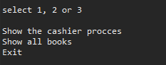

# threads

Firstly the programe show a short menu. The options of this menu are titles which are in a containers. 

Through the interface i define the void which show the menu lines. When i have defined the interface i have created three classes whith 

the menu options. After that i only need to call the container in the main menu with the parameters that i have created.

In this code we define the interface:

      public interface Interfaz {

	public abstract void mensaje();
     }

In this code we define the container:

        public class Contenedor {

	private Interfaz interfaz;
	 
	public Contenedor(Interfaz interfaz){
	 
	this.interfaz=interfaz;
	 
	}
	 
	public void mensaje(){
	 
		interfaz.mensaje();
	 
	}

Now we generate de message that we wont send to the container:

        public class Books implements Interfaz{

	 public void mensaje(){
			 
			 System.out.println("Show all books");

			}

	}

When we have these procces we create the calls in the main manu: 

                Interfaz titulo = new Titulo();
		Interfaz exit = new Exit();
		Interfaz List = new Books();
		
		
                Contenedor contenedor = new Contenedor(titulo); 
	        contenedor.mensaje(); // the code show us the cashier procces
			
		contenedor = new Contenedor(List);
	        contenedor.mensaje();  // the code show us the list books option
		    
		contenedor = new Contenedor(exit);
	        contenedor.mensaje();   // the code show us the exit option
 

For the firt option i have used threads:

Firstly i have create a Runnable_class. In this class i have create the costumers and cashiers and the time method.

In this class i create the new start threads for the diferents costumers that i have created.

                Costumer cliente1 = new Costumer("Juan Pedro", new int[] { 2, 2, 1, 5, 2, 3 });
		Costumer cliente2 = new Costumer("Manoli", new int[] { 1, 3, 5, 1, 1 });
		Costumer cliente3 = new Costumer("luis", new int[] { 1, 2, 5, 1, 1, 2, 4});

		
		Cajera cajera1 = new Cajera("Sara");
		Cajera cajera2 = new Cajera("Marta");
		Cajera cajera3 = new Cajera("Manuel");
		
		long initialTime = System.currentTimeMillis();
		
		Runnable proceso1 = new Runnable_class(cliente1, cajera1, initialTime);
		Runnable proceso2 = new Runnable_class(cliente2, cajera2, initialTime);
		Runnable proceso3 = new Runnable_class(cliente3, cajera3, initialTime);

		new Thread(proceso1).start();
		new Thread(proceso2).start();
		new Thread(proceso3).start();

Sencondtly i have created Cajera_thread. In this class i have created the procces that the cashier use for the sale.

I have created too a class whith the main thread, in this thread i start the costumer thread and cashier thread.

Finally i have created a cajera class: in this class i show thre threatds distribution:

                System.out.println("");
		System.out.println("-caja- nombre del responsable: " + this.nombre + 
				", procesando la compra del cliente: ");
		System.out.println(" nombre del cliente: " + cliente.getNombre() + 
				" tiempo empleado: " + (System.currentTimeMillis() - timeStamp) / 1000	+
				"seg");

		for (int i = 0; i < cliente.getCarroCompra().length; i++) { 
				this.esperarXsegundos(cliente.getCarroCompra()[i]); 
				System.out.println("Procesado el producto " + (i + 1) +  
				" ->Tiempo: " + (System.currentTimeMillis() - timeStamp) / 1000 + 
				"seg");
		}

		System.out.println("");
		System.out.println("La cajera " + this.nombre + " ha terminado el proceso de venta de " + 
				cliente.getNombre() + " EN EL TIEMPO: " + 
				(System.currentTimeMillis() - timeStamp) / 1000 + "seg");
		System.out.println("");

	}
	
	
	
	
	
	
	
	

	
	
	

I have used this code:

              private void esperarXsegundos(int segundos) {
		try {
			Thread.sleep(segundos * 1000);
		} catch (InterruptedException ex) {
			Thread.currentThread().interrupt();
		}
	}

to organize int the time the proccess 

 
 
 
 Finally i have created test for Books_dates class:
 
 
     class Books_dates_test {

	@Test
	void test() {
		
		Books_dates test = new Books_dates("String_1","String_2","String_3",23);
		assertEquals(test.getCategorie(),"String_1");
		assertEquals(test.getName(),"String_2");
		assertEquals(test.getAuthor(),"String_3");
		assertEquals(test.getPrice(), 23);
		
		
		
		fail("Not yet implemented");
	}

}
 
 
 
 
 
 
 
 
